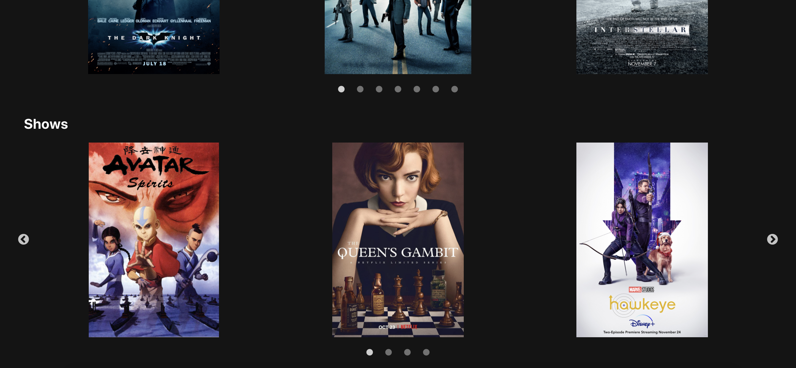

# Favorites-Gallery-App

This app contains galleries of some of my favorite things (just movies and shows for now).
It contains carousels (lazy loading!), a navbar, and a router.

I used React, React Router, React Bootstrap, and React Slick to build it.

## Heroku App
`Favorites Gallery App`
- Visit my Heroku app: https://favorites-gallery.herokuapp.com/

## Example
### Homepage: Movies Carousel

### Homepage: Shows Carousel

### About Page

## How To Run

1. Run:

### `npm install`

2. Then run:

### `npm start`
