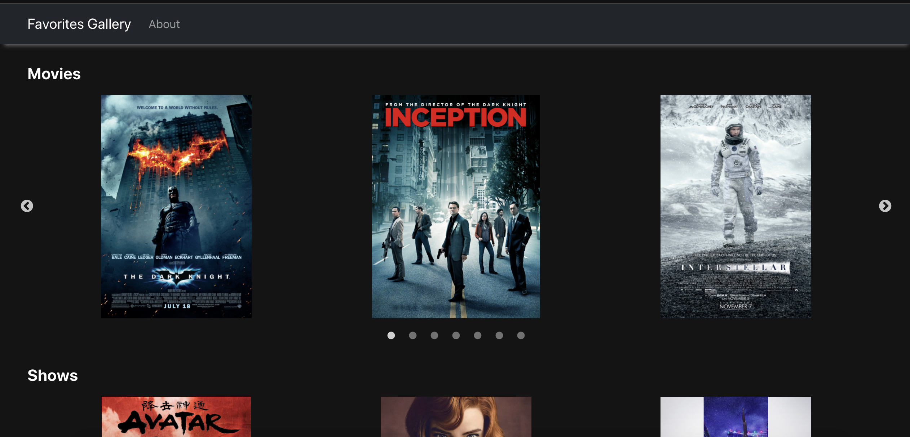
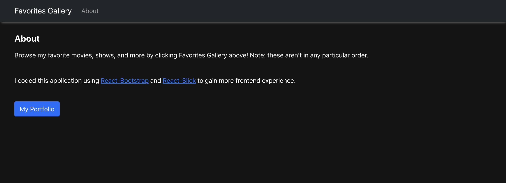

# Favorites-Gallery-App

This app contains galleries of some of my favorite things (just movies and shows for now).
It contains carousels (lazy loading!), a navbar, and router.

I used React, React Router, React Bootstrap, and React Slick to build it.

## Example

## How To Run

1. In the `app` directory, run:

### `npm install`

2. Then run:

### `npm start`
